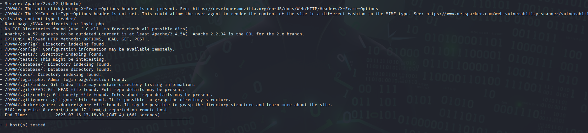

# FUTURE_CS_01
# 🧪 Web Application Testing Report – DVWA

## 1. Project Information

| Field             | Details                                      |
|------------------|----------------------------------------------|
| **Application**   | Damn Vulnerable Web Application (DVWA)       |
| **Test Date**     | [11/07/2025 – 11/08/2025]                      |                  |
| **Environment**   | Hostinger VPS |
| **Security Level**| Low / Medium / High / Impossible             |
| **Tools Used**    | Burp Suite, OWASP ZAP, Nikto, curl, etc.     |

---

## 2. Test Objectives

- Identify and exploit vulnerabilities in DVWA modules.
- Validate known web application weaknesses.
- Practice manual and automated testing techniques.
- Demonstrate mitigation strategies for common security flaws.

---

## 3. Scope of Testing

**Modules Tested**
- [x] Brute Force  
- [x] Command Injection  
- [x] CSRF  
- [x] File Inclusion  
- [x] File Upload  
- [x] SQL Injection  
- [x] XSS (Reflected & Stored)  
- [x] Security Level Validation  

## 4. Methodology

| Aspect         | Description                                         |
|----------------|-----------------------------------------------------|
| **Approach**    | Manual testing with automated tool assistance      |
| **Test Types**  | Penetration Testing, Vulnerability Assessment      |
| **Tools Used**  | Burp Suite, OWASP ZAP, Nikto, browser devtools |
| **Security Levels Tested** | Low / Medium / High / Impossible        |

---

## 5. Summary of Findings

| Vulnerability         | Module            | Severity | Exploited | Status     | Notes                              |
|-----------------------|-------------------|----------|-----------|------------|------------------------------------|
| SQL Injection         | SQL Injection     | High     | ✅        | Confirmed  | `' OR 1=1--` exploited             |
| Stored XSS            | XSS (Stored)      | High     | ✅        | Confirmed  | Persistent `<script>` executed    |
| Reflected XSS         | XSS (Reflected)   | Medium   | ✅        | Confirmed  | Alert triggered                    |
| Command Injection     | Command Injection | High     | ✅        | Confirmed  | Executed OS commands via input    |
| File Upload Bypass    | File Upload       | High     | ✅        | Confirmed  | Uploaded web shell `.php`         |
| CSRF                  | CSRF              | Medium   | ✅        | Confirmed  | Admin password reset              |
| Brute Force           | Brute Force       | Medium   | ✅        | Confirmed  | Weak creds discovered             |
| Local File Inclusion  | File Inclusion    | High     | ✅        | Confirmed  | Accessed `/etc/passwd`            |

---

## 6. Detailed Vulnerabilities

### Nikto

I used Nikto to scan for vulnerabilities on the webpage.. 
Nikto found a login.php databases and config files.

### 🔍 Brute Force Login Page

- **Module:** Brute Force  
- **Level:** Low-Impossible
- **Payload:** Dictionary Attack
- **Result:** Login Page accessed  
- **Mitigation:** Use stronger Password and implement strong password policies

---

## 7. Tools Used

| Tool         | Purpose                          |
|--------------|----------------------------------|
| Burp Suite   | Proxy, request tampering         |
| OWASP ZAP    | Active vulnerability scanning    |
| Nikto        | Web server scanner               |
| curl         | HTTP request crafting            |
| Firefox DevTools | Input/output inspection      |

---

## 8. Screenshots / Evidence

> (Optional) Add screenshots of:
> - XSS alert boxes
> - SQLi results
> - Shell access from file upload
> - Request/response payloads

---

## 9. Recommendations

| Area              | Recommendation                                   |
|-------------------|--------------------------------------------------|
| Input Validation  | Sanitize and validate all user input server-side |
| Output Encoding   | Use HTML/JS escaping for outputs                 |
| File Handling     | Restrict file types, validate MIME types         |
| Authentication    | Implement rate limiting, strong password rules   |
| CSRF Protection   | Use CSRF tokens with same-site cookie flags      |
| Logging & Alerts  | Monitor unusual activity                         |

---

## 10. Conclusion

DVWA successfully demonstrated the impact of common web application vulnerabilities under various security levels. The hands-on testing reinforces best practices in secure coding, vulnerability mitigation, and the need for continuous security assessments in real-world applications.

---
